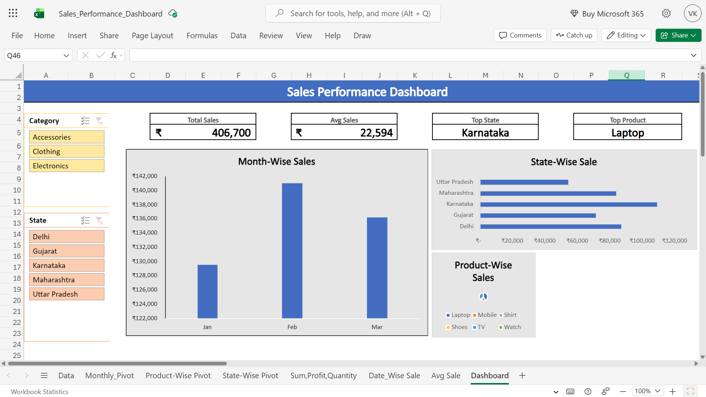

# Sales-Analysis-Dashboard
Interactive Excel Dashboard for Sales Performance Analysis.

## Preview

## Key Features
- **Dynamic Slicers:** Filter data by Category and State.
- **Visual Insights:** Monthly sales trends and Regional performance.
- **Automated Calculations:** Built using Pivot Tables for real-time analysis.

## Tools Used
- Microsoft Excel (Online Version)
- Pivot Tables & Charts
- Data Formatting & Visualization
